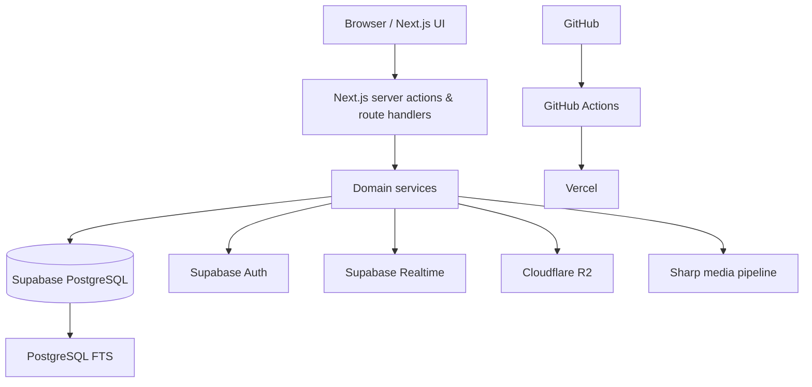

# Technical Architecture

## Architectural style

**Modular monolith.**

The project does not need microservices. Domain boundaries should be clear enough to extract later, but deployment should remain simple.

## High-level topology



## Suggested repository layout

```text
apps/
  web/
packages/
  ui-historical/
  domain/
  db/
  contracts/
  config/
  test-utils/
docs/
plans/
scripts/
```

A single Next.js app repository is also acceptable initially if packages are premature. Keep conceptual boundaries either way.

## Domain modules

- identity
- follows
- audiences/circles
- posts
- comments
- plus-ones
- reshares
- collections
- communities
- notifications
- moderation
- media
- search
- demo/seed

## Server-side rule

The browser may request an action, but domain services decide whether it is allowed.

Avoid:

```text
Browser -> direct business mutation in Supabase table
```

Prefer:

```text
Browser -> server action/route -> Zod -> auth -> domain service -> authorization -> DB
```

Realtime subscriptions may read approved event streams but must not become a bypass around domain authorization.

## Data access

- Drizzle ORM for schema and common queries.
- Raw SQL allowed for feed/search/query optimization when justified and tested.
- All schema changes through migrations.
- All important foreign keys indexed.
- Use `EXPLAIN ANALYZE` before adding speculative caching.

## Feed strategy

v1 should favor correctness and simplicity:

1. resolve followed people/Collections/Communities;
2. filter by visibility/membership/block rules;
3. order by a documented simple relevance/recency policy;
4. cursor paginate.

Do not attempt to recreate Google's proprietary ML ranking.

## Caching

Start minimal. Candidates later:

- public profile/Collection/Community page caching
- link-preview metadata
- expensive search facets
- repeated feed identity sets

Never cache private/limited content without an explicit audience-safe key strategy.

## Realtime

Use Supabase Realtime primarily for:

- notification insertion updates
- selected comment/post updates where the UX benefits

Do not make every database change realtime by default.

## Deployment

- Vercel: Next.js
- Supabase: PostgreSQL/Auth/Realtime
- Cloudflare R2: media
- GitHub Actions: lint, typecheck, tests, migrations checks, build

## Portability

Avoid designing the domain around Supabase-only semantics. RLS can add defense-in-depth, but business authorization must remain understandable in the application/domain layer.
