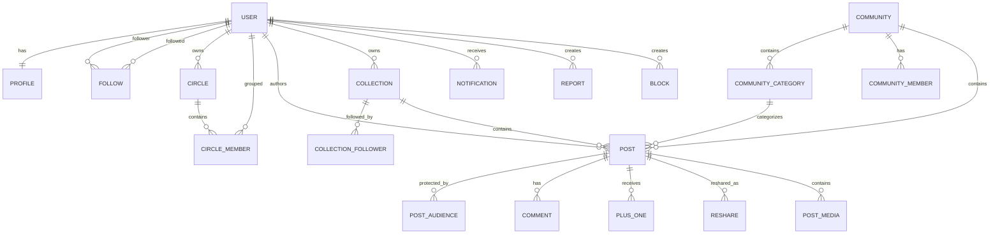

# Domain & Data Model

This schema is a modern implementation model. It is **not** a claim about Google's internal database.

## Core entities

### Identity

- `users` — authentication identity reference
- `profiles` — display name, handle, bio/about, avatar, cover, links, profile metadata
- `follows` — directed user-to-user follow edges

### Circles / audiences

- `circles` — user-owned private audience/list groups
- `circle_members` — members of a circle
- `post_audiences` — audience rules attached to a post

### Content

- `posts`
- `post_media`
- `post_links`
- `post_mentions`
- `comments`
- `comment_media`
- `plus_ones`
- `reshares`

### Collections

- `collections`
- `collection_followers`
- posts may reference a `collection_id` when historically valid

### Communities

- `communities`
- `community_categories`
- `community_members`
- posts may reference `community_id` and `community_category_id`

### Notifications

- `notifications`

### Safety

- `blocks`
- `mutes` if implemented
- `reports`
- `moderation_actions`

### Media/search/support

- `media_assets`
- `link_previews`
- `invites`
- `audit_events` for sensitive admin actions

## ERD



## Post model

Suggested fields:

```text
id
idempotency_key?         # for publish retry protection
author_id
body
visibility_mode
collection_id?
community_id?
community_category_id?
reshare_of_post_id?
created_at
updated_at
edited_at?
deleted_at?
```

## Audience semantics

Possible internal modes:

- `PUBLIC`
- `FOLLOWERS` only if historically justified for the selected flow
- `YOUR_CIRCLES`
- `SPECIFIC_CIRCLES`
- `SPECIFIC_USERS`
- `COMMUNITY`
- `PRIVATE`

Do not expose an internal mode in the UI unless the historical product had an equivalent.

### Snapshot versus dynamic membership

Decide explicitly whether Circle-based audience visibility follows membership dynamically or snapshots recipients at publish time. Historical evidence should drive this. Until resolved, treat it as an open question and avoid hard-coding semantics.

## Community roles

Suggested:

- `OWNER`
- `MODERATOR`
- `MEMBER`

Membership states:

- `PENDING`
- `ACTIVE`
- `BANNED`
- `LEFT`

## Indexes

Minimum likely indexes:

- `posts(author_id, created_at desc)`
- `posts(collection_id, created_at desc)`
- `posts(community_id, created_at desc)`
- `comments(post_id, created_at)`
- `follows(follower_id, followed_id)` unique
- `collection_followers(user_id, collection_id)` unique
- `community_members(community_id, user_id)` unique
- `circle_members(circle_id, user_id)` unique
- `notifications(user_id, created_at desc)`
- `plus_ones(post_id, user_id)` unique
- `blocks(blocker_id, blocked_id)` unique

Add FTS indexes after the search shape is finalized.

## Lifecycle rules

- Prefer soft deletion for moderation/audit-sensitive entities.
- User-owned deletion must remove content from ordinary views promptly.
- Private media must not remain publicly addressable through stable object URLs.
- Reshare deletion semantics require historical research before final behavior.
