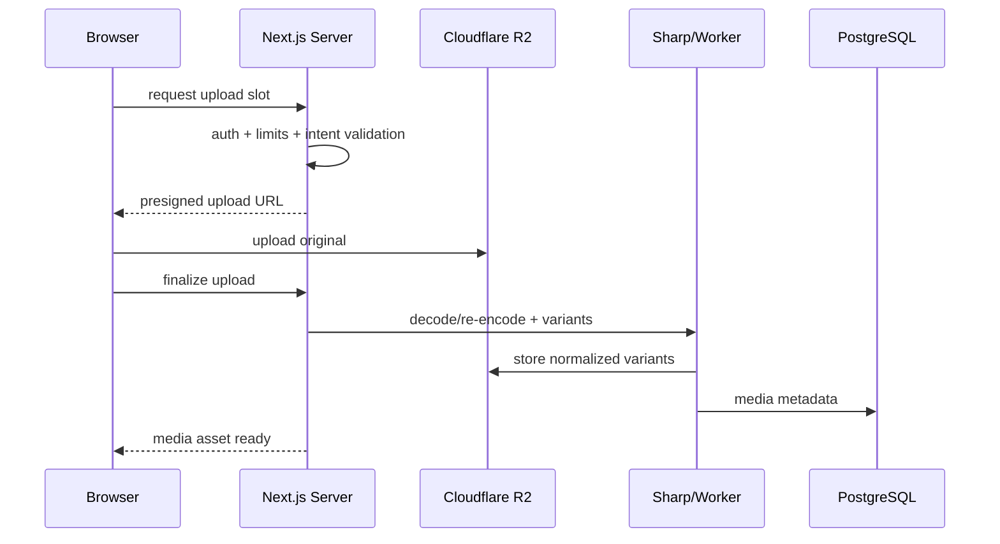

# Media & Search

## Media architecture

### Upload flow

For low volume, Sharp processing may run in the application path if platform limits permit. If not, move it to a lightweight worker without changing the domain contract.

## Media variants

At minimum consider:

- original normalized master
- feed-large
- feed-medium
- thumbnail
- avatar/cover variants where applicable

Store width/height, MIME, byte size, and ownership.

## Privacy

Public media may use public/cacheable URLs. Limited/private media should use signed access or a controlled proxy strategy so knowing the object key does not grant access.

## Link previews

- server fetch only
- SSRF protections
- timeouts and maximum body sizes
- cache normalized metadata
- sanitize title/description
- proxy or carefully validate preview images

## Search v1

Use PostgreSQL full-text search for:

- profiles
- Collections
- Communities
- public posts

Keep private/limited post search scoped by the same visibility rules as direct viewing.

## Search evolution

Only introduce Meilisearch/OpenSearch/etc. if:

- result quality demands it;
- database load proves problematic;
- advanced typo tolerance/faceting becomes a real requirement.

Do not add external search infrastructure preemptively.
